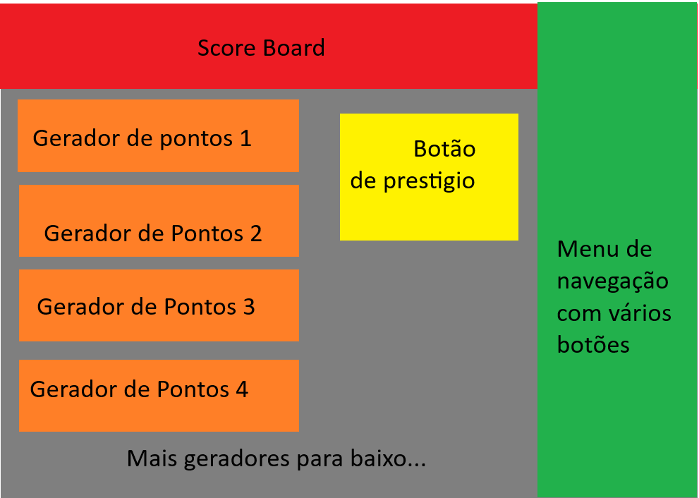

# Fundação do Jogo Incremental (Godot)

> Documento de referência do projeto: conceito, mecânicas, regras de balanceamento e
> estrutura do código. O projeto Godot já existe neste repositório (`project.godot`,
> Godot 4.6, GL Compatibility) — este arquivo descreve as intenções de design e como
> elas estão materializadas no código.

## 1. Conceito

Jogo incremental (idle/clicker) minimalista, misturando mecânicas de:

- **AdVenture Capitalist** — múltiplos geradores comprados em paralelo, custo crescendo exponencialmente por unidade comprada, compra em lote.
- **Revolution Idle** — múltiplas camadas de prestígio empilhadas, cada uma resetando a progressão anterior em troca de uma moeda/multiplicador permanente.
- **Clicker Heroes** — geração passiva (produção por segundo) como protagonista, e um reset de camada alta por multiplicadores permanentes.

O tema visual é **cor**: cada gerador é uma cor, e as tags de cor (`PRIMARY`, `SECONDARY`,
`WARM`, `COOL`, `NEUTRAL`, `LIGHT`, `DARK`, `ORE`) são o que amarra geradores e upgrades.
Um upgrade não afeta "o gerador 3", ele afeta "todos os geradores quentes" — é por aí que
sinergias e escolhas de build aparecem.

## 2. Layout de UI



```
┌─────────────────────────────────────────────┬────────┐
│               Score Board                   │        │
├──────────────────────┬──────────────────────┤Menu de │
│  Gerador de pontos 1 │      ┌─────────────┐ │navega- │
├──────────────────────┤      │Botão de     │ │ção com │
│  Gerador de Pontos 2 │      │Prestigio    │ │vários  │
├──────────────────────┤      │Oculto       │ │botões  │
│  Gerador de Pontos 3 │      │(Req. de 10M)│ │        │
├──────────────────────┘      └─────────────┘ │        │
│  Gerador de Pontos 4                        │        │
│  ... (lista rolável, quantidade em aberto)  │        │
└─────────────────────────────────────────────┴────────┘
```

- **Score Board (topo)**: dinheiro atual e pontos de prestígio; deve crescer para cobrir
  também produção por segundo e resumo dos multiplicadores ativos.
- **Lista de geradores (coluna principal)**: rolável, construída dinamicamente a partir de
  `data/generators.json` — nunca uma cena por gerador copiada à mão.
- **Menu de navegação (coluna lateral)**: troca o painel exibido (Geradores, Upgrades,
  Prestígio) mantendo o Score Board sempre visível. É um "trocador de painel"
  (`show()`/`hide()` em `scenes/Main.tscn`), não troca de cena.
- **Botão de Prestígio**: escondido até o marco de desbloqueio (1.000.000.000 de dinheiro
  total acumulado).
- **Tela de inventário**: overlay aberto pelo botão de inventário de cada gerador, some
  ao fechar; todo o estado vive no modelo, então reabrir restaura tudo.

### 2.1 Especificações

- **Estética minimalista**: cores chapadas (flat colors), sem texturas/gradientes complexos,
  tipografia simples e legível, bastante espaço negativo. As cores do esboço
  (vermelho/laranja/cinza/verde) são placeholders de estrutura, não a paleta final.
- **Tamanho**: detalhamento com base em 128 px. Células de inventário são 64 px.
- **Viewport**: 960x540, `canvas_items` stretch.

## 3. Mecânicas principais

### 3.1 Geradores

- Cada gerador tem: nome, custo base, taxa de crescimento de custo, produção base,
  tempo de produção (`wait_time`), cor e tags.
- Produção é por **timer próprio de cada gerador** (barra de progresso que enche e paga),
  não um tick global — geradores lentos pagam mais por ciclo.
- Compra em lote: 1 / 5 / 25 / 100 / MAX (clique esquerdo avança, direito volta).
- Geradores aparecem progressivamente: um gerador só fica visível quando o jogador chega
  a 60% do seu custo, e só começa a produzir depois da primeira compra.
- **Bônus de nível**: a cada 25 unidades possuídas o gerador ganha +1x multiplicativo
  (`amount / 25 + 1`). É o que dá sentido a upgrades de redução de preço.

### 3.2 Clique manual

- Não existe hoje. Toda a produção é passiva via timers. Ponto em aberto: se o clique
  voltar, precisa de um lugar que não brigue com a leitura minimalista da tela.
- Talvez nunca exista, pois o jogador precisa passar a maior parte do tempo pressionado
  os botões de compras de geradores.

### 3.3 Upgrades

- Upgrades são **data-driven** (`data/upgrades.json`) e se aplicam por tag, não por
  gerador nomeado.
- Tipos de bônus: `ADD` (soma na produção base), `MUL` (multiplicador), `POW` (expoente),
  `PRICE` (redução de custo), `PRESTIGE` (ganho de prestígio), `UNIQUE` (efeito escrito
  em GDScript).
- Moedas de compra: `MONEY`, `PRESTIGE`, `ITEM`.
- Cada upgrade tem `buy_limit` e `cost_increase` próprios — upgrades recompráveis e
  upgrades de compra única usam a mesma estrutura.

### 3.4 Camadas de prestígio

- **Prestígio (camada 1)** — já funciona. Reseta geradores, dinheiro e upgrades comprados
  com dinheiro; mantém upgrades comprados com prestígio. Dá pontos de prestígio, que
  viram um multiplicador global de produção via `prestige_power` (0.2 default).
  - Ganho: `floor(sqrt(total_money / (1e7 * (pontos_atuais + 1))) * bônus_de_prestígio)`.
  - Só é permitido prestigiar quando o ganho supera os pontos atuais. !!(ALTERAÇÃO)!!
- **Weaponize (camada 2)** — reset mais profundo (zera inclusive prestígio e upgrades de
  prestígio) em troca de um **item**. Marco de desbloqueio: 1.000.000.000 de pontos de
  prestígio. Ver seção 6 — está incompleto.
- Ganha tokens que serão a moeda desaa camada para comprar upgrades relacionados a itens.
- Tokens será uma outra moeda e não dependerá de MONEY nem PRESTIGE.
- Camadas acima disso ainda não foram definidas.

### 3.5 Itens e inventário

- Cada gerador tem sua própria grade de inventário (`GeneratorInventory`, 3x3 por padrão).
- Itens têm footprint em células (`space`, ex. 1x1, 1x2, 2x2) — encaixe estilo
  Resident Evil / Backpack Battles: arrastar do armazenamento do jogador para a grade,
  mover dentro da grade, devolver ao armazenamento.
- Um item colocado equivale a comprar um upgrade escondido: `GeneratorItem.upgrade_name`
  aponta para uma entrada de `upgrades.json`, e `get_item_upgrades()` devolve
  `{upgrade_name: quantidade}` que é mesclado aos upgrades do jogador **só no cálculo
  daquele gerador**. Duas cópias do mesmo item = upgrade de nível 2 ali.
- Itens podem ter efeitos genéricos (reaproveitam os tipos ADD/MUL/POW/PRICE) ou únicos
  (Callable em `UniqueEffects`).
## MUDANÇAS

- Muito provavelmente a parte de espaço dentro do inventário será mudado para conter padrões mais complexos
  Ex: Formatos do tipo L ou outros formatos criativos.

## 4. Números grandes

- Classe `BigNumber` própria (mantissa + expoente). Mostra o sufixo até o Centilhão, mas
  não usa sufixo abaixo de 1.000.000.000 (um bilhão).

- Ex:
```
	1e3  -> 1.000 (Mil)
	1e6  -> 1.000.000 (Mi)
	1e9  -> 1.000.000.000 (Bi)
	1e12 -> 1 T (Tri)
	...
```
- Caso a opção de notação científica esteja ativa, ela sempre prevalece.

## 5. Save/Load

- Ainda não implementado. Precisa cobrir no mínimo: dinheiro atual e total acumulado,
  geradores possuídos, upgrades comprados, pontos e poder de prestígio, itens no
  armazenamento do jogador e o conteúdo/posições de cada `GeneratorInventory`.
- Nota de formato: os inventários usam **uid por instância**, então o save precisa
  persistir o `_next_uid` ou reindexar na carga.
- Save demorará ainda para ser implementado. É necessário decidir ainda o que será salvo e nem tudo que será salvo foi implementado.

## 6. Em construção (existe parcialmente ou ainda não existe)

### 6.1 Finalizar o sistema de Weaponize

- Gerar os upgrades de tokens.

### 6.2 Integração dinâmica de upgrades para alvos fora dos geradores

Hoje `UpgradeEffect` só é consultado dentro do cálculo de gerador (produção e preço) e no
cálculo de ganho de prestígio, cada um com um laço próprio dentro de
`ProductionCalculator`. A intenção é generalizar: um alvo de bônus deve poder ser
declarado no JSON e resolvido dinamicamente, tanto para upgrades genéricos quanto para
efeitos únicos, sem precisar escrever um laço novo por alvo.

Alvos previstos:

- **Multiplicador de ganho de prestígio** — já existe como `PRESTIGE`, mas fora do
  sistema genérico; deve entrar no mesmo mecanismo dos outros.
- **Multiplicador de quantidade ao comprar** — comprar 1 gerador conta como N.
- **Redução de preço dos upgrades** — hoje `PRICE` só afeta o custo de geradores;
  `get_upgrade_cost()` ignora upgrades por completo.

Ponto de design: isso pede um "escopo de aplicação" no upgrade (o que ele modifica) além
das tags de cor (quem ele modifica), para que `ProductionCalculator` possa varrer os
upgrades relevantes de um alvo sem hardcode.

## 7. Estrutura do código

### 7.1 Visão geral de pastas

```
Game.gd                    Autoload: dono do Player e registro de Configurações
classes/
  BigNumber.gd             Aritmética de números grandes (mantissa + expoente)
  Generator.gd             Definição imutável de um gerador
  Player.gd                Estado do jogador + todas as ações (comprar, prestigiar...)
  gameEvents/              Barramento de sinais e eventos de marco
  items/                   GeneratorItem (definição) e GeneratorInventory (grade)
  upgrades/                Upgrade, UpgradeEffect e os efeitos únicos
  utils/                   DataLoader, Enums, ProductionCalculator
data/                      generators.json, upgrades.json, items.json (conteúdo do jogo)
nodes/                     Componentes de UI reutilizáveis (card de gerador, de upgrade...)
scenes/                    Telas (Main, Geradores, Upgrades, Prestígio, Inventário)
```

Regra que organiza tudo isso: **`classes/` não conhece a UI**. Nada em `classes/` estende
`Node` ou toca em `$caminho` (com exceção do autoload `GameEventsManager`). A UI lê o
estado e escuta sinais; nunca calcula nada por conta própria.

### 7.2 Fluxo de dados

```
data/*.json
    │  (carregado e cacheado uma vez)
    ▼
DataLoader ──► Generator / Upgrade / GeneratorItem   (definições, imutáveis)
                        │
                        ▼
Player (estado: quanto de cada coisa) ──► ProductionCalculator (funções puras)
    │                                              │
    │  emite sinais                                └──► BigNumber de custo/produção
    ▼
GameEventsManager ──► GameEvents (barramento) ──► nodes/ e scenes/ (UI)
```

O caminho de uma compra: o botão chama `Player.buy_generator()` → o Player pergunta o
custo ao `ProductionCalculator` → desconta e atualiza o dicionário → emite `gen_bought`
→ `GameEventsManager` traduz para `update_gen_info` → cada `GeneratorNode` interessado
recalcula seus labels. A UI nunca altera o estado diretamente.

### 7.3 Classes principais

#### `Generator` — `classes/Generator.gd`

Definição imutável de um gerador, construída pelo `DataLoader` a partir do JSON. Não
guarda quantidade possuída (isso é do Player) nem produção efetiva (isso é do
`ProductionCalculator`) — é só a ficha técnica.

```gdscript
class_name Generator

var generator_name: String              # Nome de exibição ("Red")
var icon_path: String

var base_cost: BigNumber                # Custo da primeira unidade
var cost_increase: float                # Multiplicador de custo por unidade (ex. 1.07)

var base_production: BigNumber          # Produção por ciclo, por unidade, sem bônus
var wait_time_production: float         # Segundos por ciclo de produção

var tags: Array[Enums.GenTags]          # PRIMARY, WARM, ORE...
var gen_color: Color

func has_any_tag(_target_tags) -> bool  # true se compartilha alguma tag (ALL casa com tudo)
```

`has_any_tag()` é o ponto de contato com os upgrades: é assim que "upgrade de cores
primárias" descobre que se aplica a este gerador.

#### `Player` — `classes/Player.gd`

Todo o estado mutável do jogo e todas as ações que o alteram. É a única classe que muda
estado; qualquer coisa que o jogador "faz" passa por aqui. Nada de UI dentro dela.

```gdscript
class_name Player

# --- Recursos ---
var money: BigNumber
var total_money: BigNumber                              # Acumulado da run (base do prestígio)
var prestige_points: BigNumber
var prestige_power: float                               # Força do multiplicador de prestígio

# --- Posses (nome da definição -> quantidade) ---
var generators: Dictionary[String, BigNumber]
var upgrades:   Dictionary[String, int]
var items:      Dictionary[String, int]                 # Armazenamento, item_id -> stack
var generators_inventory: Dictionary[String, GeneratorInventory]

# --- Preferências de compra ---
var gen_buy_amount: int                                 # 1/5/25/100 (clamp 1..1.000.000)
var upgrade_buy_amount: int
var max_gen_buy: bool                                   # Modo MAX ignora gen_buy_amount

# --- Sinais (a UI só reage a estes) ---
signal money_changed(_new_value)          signal prestige_points_changed(_new_value)
signal gen_bought(_generator_name)        signal gen_unlocked(_generator_name)
signal upgrade_bought(_upgrade_name)
signal prestiged()                        signal weaponized()

# --- Ações ---
func buy_generator(_generator_name) -> bool      # Valida custo, desconta, emite sinais
func buy_upgrade(_upgrade_name, _currency) -> bool
func produce(_amount)                            # Chamado quando um ciclo completa
func prestige()                                  # Camada 1: converte total_money em pontos
func weaponize(_item)                            # Camada 2: reset total por um item
func reset_progression(_reset_all_upgrades, _reset_prestige)

# --- Consultas (delegam ao ProductionCalculator) ---
func get_generator_amount(_name) -> BigNumber
func get_generator_cost(_name) -> BigNumber
func get_generator_production(_name) -> BigNumber   # Mescla upgrades globais + itens da grade
func get_upgrade_amount(_name) -> int
func get_upgrade_cost(_name) -> BigNumber
func get_generator_inventory(_name) -> GeneratorInventory
```

Detalhe importante em `get_generator_production()`: ele mescla os upgrades vindos dos
itens daquele gerador com os upgrades globais **em um dicionário temporário**. Os itens
nunca entram em `Player.upgrades` — o efeito fica confinado ao gerador que carrega o item.

`reset_progression()` é compartilhado pelas duas camadas de reset; os flags decidem quão
fundo o reset vai.

#### `Upgrade` — `classes/upgrades/Upgrade.gd`

Definição imutável de um upgrade, também vinda do JSON. A quantidade comprada mora em
`Player.upgrades`; aqui só está a regra.

```gdscript
class_name Upgrade

var upgrade_name: String
var description: String
var icon_path: String

var currency: Enums.UpgradeCostTags     # MONEY, PRESTIGE, ITEM
var cost: BigNumber                     # Custo do primeiro nível
var cost_increase: float                # Escala por nível comprado
var buy_limit: int                      # Níveis máximos (1 = compra única)

var tags: Array[Enums.GenTags]          # A quem se aplica (ALL = todos)
var upgrade_effect: UpgradeEffect       # O que faz
```

O par `Upgrade` (o "quanto custa / a quem se aplica") + `UpgradeEffect` (o "o que faz")
é o que permite descrever upgrades inteiramente em JSON. Escrever GDScript só é
necessário quando o efeito não cabe nos tipos padrão.

### 7.4 Demais classes

**`UpgradeEffect`** (`classes/upgrades/UpgradeEffect.gd`) — o efeito de um upgrade, como
listas paralelas `bonus_type[]` / `bonus_values[]` (um upgrade pode ser ADD **e** MUL ao
mesmo tempo). `apply_upgrade()` recebe um valor acumulado e o tipo que está sendo
calculado naquele momento, e devolve o valor modificado — ou ignora, se o upgrade não
tiver aquele tipo. Se `unique_effect` estiver preenchido, ele desvia para o Callable
correspondente em vez de usar a regra padrão.

**`UniqueEffects`** (`classes/upgrades/uniqueUpgrades/UniqueEffects.gd`) — coleção de
funções para efeitos que não cabem em ADD/MUL/POW/PRICE, resolvidas por nome
(`Callable(self, _name)`). O JSON só precisa citar o nome da função em `upgrade_effect`.
Todas seguem a mesma assinatura, então o resto do sistema não sabe a diferença entre
efeito único e genérico. Ex.: `time_flux_upgrade_effect` escala com o `wait_time` do
gerador, coisa que um multiplicador plano não consegue expressar.

**`ProductionCalculator`** (`classes/utils/ProductionCalculator.gd`) — todas as fórmulas
do jogo, em funções estáticas puras. Não guarda estado: recebe posses e upgrades, devolve
`BigNumber`. Cobre custo de gerador (soma de série geométrica para compra em lote),
quantidade máxima comprável (estimativa por logaritmo + ajuste fino), custo de upgrade,
produção efetiva (`(base + ADD) × MUL × quantidade × bônus_de_nível × bônus_de_prestígio`,
depois os expoentes POW) e ganho de prestígio. É o lugar certo para mexer em
balanceamento estrutural.

**`DataLoader`** (`classes/utils/DataLoader.gd`) — lê os JSONs de `data/`, constrói as
definições e mantém três caches estáticos (`get_generator`, `get_upgrade`, `get_item`,
e as variantes `get_all_*`). Geradores e upgrades saem do cache **ordenados por custo**,
então a ordem de exibição na tela é consequência do balanceamento, não de uma lista
manual. Nos itens, a chave do JSON é gravada de volta em `GeneratorItem.item_id` — é essa
chave (não o nome de exibição) que identifica o item nos inventários.

**`Enums`** (`classes/utils/Enums.gd`) — os enums do jogo (`GenTags`, `UpgradeCostTags`,
`UpgradeBonusTags`) mais os conversores string→enum que o `DataLoader` usa. Nome inválido
no JSON vira `push_warning`, não crash.

**`BigNumber`** (`classes/BigNumber.gd`) — aritmética e formatação de números grandes;
ver seção 4.

**`GeneratorItem`** (`classes/items/GeneratorItem.gd`) — definição de um item: `item_id`
(chave do JSON, a identidade real), nome de exibição, descrição, ícone, `space`
(footprint em células) e `upgrade_name`, o upgrade que ele concede ao ser colocado.

**`GeneratorInventory`** (`classes/items/GeneratorInventory.gd`) — o modelo da grade de um
gerador. Guarda `uid -> {item_name, position}`, com uid próprio por instância para que
cópias do mesmo item coexistam. Faz a validação de encaixe (`check_item_position()`, via
`Rect2i.intersects`) e expõe `get_item_upgrades()`, que converte os itens colocados no
dicionário de upgrades consumido pelo cálculo de produção. Não sabe nada de pixels.

**`Game`** (`Game.gd`, autoload) — dono da instância única de `Player` e do registro de
efeitos únicos. Ponto de acesso global: `Game.get_player()`.

** `GameEventsManager`** (`classes/gameEvents/`) — `GameEventsManager` (autoload) escuta os sinais do
`Player` e os retransmite pelo barramento, às vezes enriquecidos (comprar um upgrade
dispara `update_gen_info("ALL")`, forçando todos os cards a recalcular). Assim a UI se
conecta a um único lugar estável em vez de ao `Player`, e cenas podem entrar e sair sem
gerenciar conexões diretas.

**`SingleTimeEvent` / `SingleTimeEventsConditions`** (`classes/gameEvents/`) — marcos de
desbloqueio que disparam uma vez. Um `SingleTimeEvent` é um nó com duas strings exportadas
(condição e execução), testa a condição em `_process` e se remove ao disparar. As
condições ficam em `SingleTimeEventsConditions` como funções estáticas
(`prestige_reached`, `weaponize_reached`). Marco novo = uma função estática + um nó na
cena, sem tocar em código existente.

### 7.5 Camada de UI

**`nodes/`** são peças reutilizáveis: `GeneratorNode` (card de gerador — labels, botão de
compra, barra de progresso, botão de inventário), `progressBar` (o timer visual que emite
`progress_complete` a cada ciclo), `UpgradeNode` (card de upgrade) e `BuyAmountButton`
(o seletor 1/5/25/100/MAX). Cada um se conecta ao barramento no `_ready()` e se atualiza
sozinho.

**`scenes/`** são as telas: `Main` (score board + menu lateral + troca de painéis),
`GeneratorsScreen` e `UpgradesScreen` (instanciam os cards a partir do `DataLoader`),
`PrestigesScreen` e o conjunto de inventário. A UI de inventário é dividida entre
`GeneratorInventoryGrid` (a grade, com preview de encaixe verde/vermelho),
`PlacedInventoryItem` (uma instância colocada, arrastável), `PlayerInventoryPanel`
(o armazenamento, sempre slots 1x1 com contador de stack) e `InventoryItemVisual`
(construção do visual do item, com fallback para painel colorido quando não há ícone).
`inventory_scene.gd` é o orquestrador: recebe os sinais de drop e traduz para chamadas no
`GeneratorInventory` e em `Player.items`.

## 8. Regras de criação de conteúdo

### 8.1 Geradores (sujeito a mudanças)

```
Bonus_Increment = 1.5x - 3x

New_Generator_Production   = (Previous_Generator) * 100 * (2) * (Bonus_Increment)
New_Generator_Cost         = (Previous_Generator) * 50
New_Generator_Cost_Scaling = (Previous_Generator) + 0.015

Colors (Not Specific):
Red, Yellow, Blue
Orange, Green, Purple
Gray, Black, White
... Light ... (Light Red, Light Yellow...)
... Dark  ... (Dark Red , Dark Yellow ...)

Especial class of generators called Ore Generators, Have tags ORE and are more valuable.

Bonus_Increment = 3x - 9x

~Ores~: Ranging from Alloys -> Pure
Bronze, Brass, Steel
Invar, Rose Gold, Electrum
Copper, Iron, Silver
Gold, Platinum, Diamond

Last Special: Rainbow Generator -> Has all tags and a bonus increment of 20x
```

Implementados hoje: Red, Yellow, Blue, Orange, Green, Purple, Gray, Black, White.

### 8.2 Upgrades (sujeito a mudanças)

```
Upgrades must be special and have conditions. General upgrades with the tag "ALL" must be trully special and should only be conseidered in key parts of the game, such as parts where there is no espace from slow progress.

Upgrades with the tag "POW" must be rarer than other tags, as they are way more powerful than the others.

Upgrades classified by rarity to give examples of distribution:

ADD Types: Common -> Should be Upgrades more frequent, with higher levels and lower price scalling. Should keep a return value lower than the price to keep it sustainable.

PRICE Types: Common/Uncommon -> Price type upgrades should be a re-enabler to refresh the purchase amount of generators. As there is an amount bonus per 25 generators in-game. Lower reductions of 1% - 5% should be common and sometimes rebuyable, but higher discounts MUST be more rare and less rebuyable/higher cost scaling.

MUL Types: Uncommon/Rare -> This type could appear more frequent deppending on it's upgrade. It shouldn't be a problem if it's only a 10% - 50% Increase. But there should be higher thought to make a higher upgrader of 50%+. It really does'nt need to be that rare, but it must be tested.

POW Types: Legendary -> Upgrades of type POW can't be openly created, it must be thought to serve as a stepping stone to achieve late parts of the game. It must be considered if this upgrade should be exclusive to PRESTIGE cost Upgrades. There are some reasons to keep some in the MONEY cost category, but it should not be a huge amount.
```

### 8.3 Adicionando conteúdo na prática

- **Gerador novo**: uma entrada em `data/generators.json`. Nada de código — o
  `DataLoader` constrói, ordena por custo e a tela instancia.
- **Upgrade genérico novo**: uma entrada em `data/upgrades.json` com `bonus_type`,
  `bonus_value` e `tags`.
- **Upgrade único novo**: a função em `UniqueEffects` + a entrada no JSON com
  `bonus_type: "UNIQUE"` e `upgrade_effect` apontando para o nome da função.
- **Item novo**: a entrada em `data/items.json` apontando para um upgrade existente (ou
  novo) via `upgrade_name`; o `space` define o footprint na grade.

### 8.4 Templates de criação de data

- Seguintes templates para a criação de data preenchidos com valores padrões.
- Qualquer valor pode ser omitido. Ficando com o valor padrão na hora da contrução.

```JSON
Geradores:
"": {
  "name": "",
  "cost": "1",
  "cost_increase": 1.0,
  "base_production": "1",
  "wait_time": 1.0,         
  "icon_path": "",          
  "color": [0,0,0],
  "tags": ["PRIMARY"]
}

Uprades:
"": {
  "name": "",
  "description": "",
  "cost": "1",
  "cost_increase": 1.3,                 
  "buy_limit": 1,                       
  "bonus_type": "ADD",
  "bonus_value": "1",
  "icon_path": "",
  "tags": ["ALL"],                      
  "currency": ""                
}

Itens:
"": {
  "name": "",
  "description": "",
  "upgrade_name": "",
  "icon_path": "",
  "space": [1,1]
}

```
## 9. Em aberto

- **Weaponize**: sorteio de item; ganho de tokens; Upgrades de itens.

- **Upgrades**: Otimizar script de aplicação de Upgrades; Moldar Upgrades de Upgrades/Itens; Upgrades de alvos únicos.

- **Balanceamento**: O jogo ainda parece muito fácil, talvez seja necessário aumentar as condições de layers.

- **Arte**: Ainda é necessário modificar e decidir a paleta de cores de fundo das telas.

- **Conteúdo**: É necessário revisitar a lista de Upgrades e criar novos itens únicos.